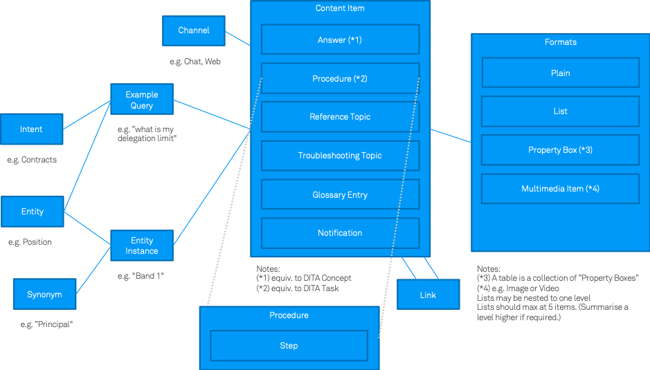
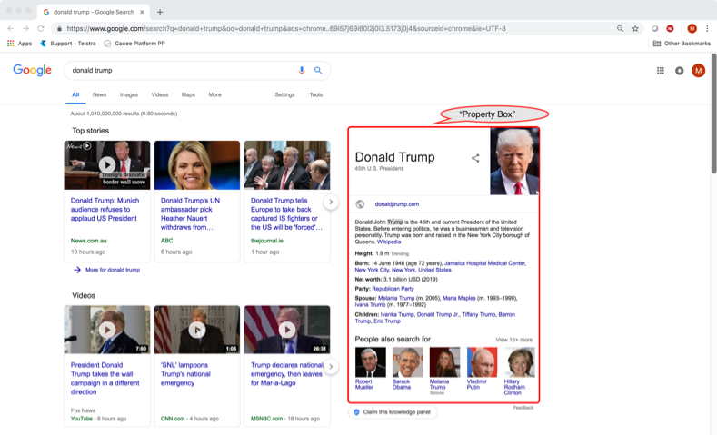
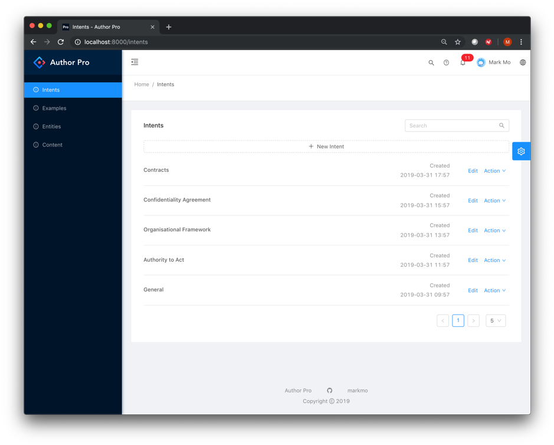
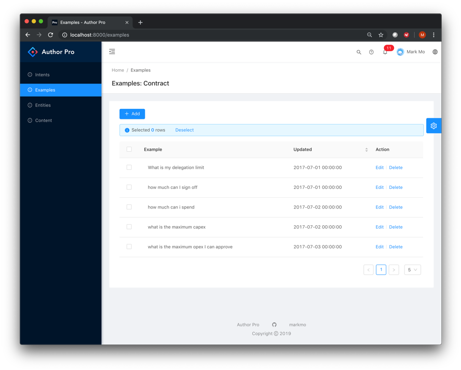
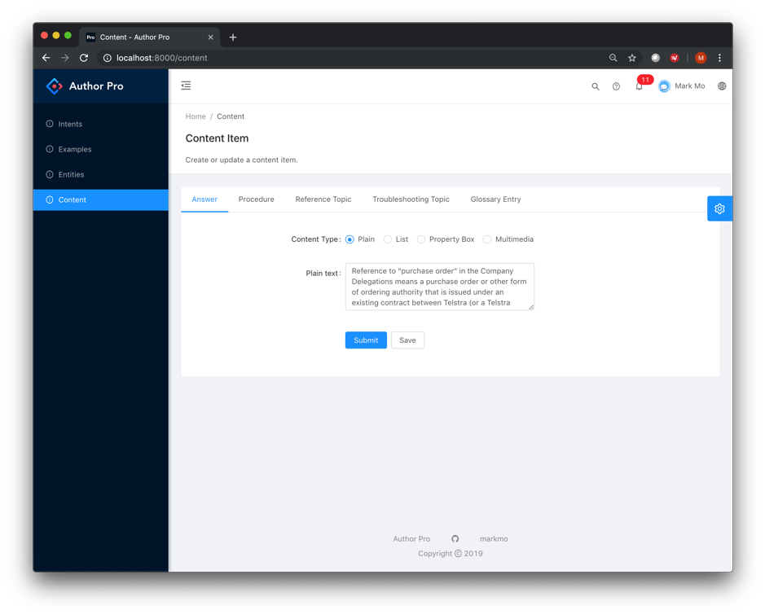
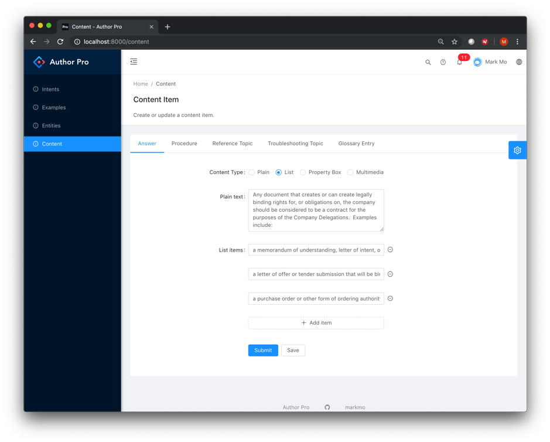

# author

### Beyond Documents to Enhance Knowledge Augmentation

Documents have a number of issues for information retrieval:

* They mix task-orientated answers with context such as background, in-depth discussion and so forth.
* Documents are designed for humans to read given time. They tend to collect as much information known 
  about a given topic to serve multiple purposes.
* They therefore take time to read, better suited to consumption outside task-specific or customer-facing 
  work flows.
* Formatting and content are mixed together, making it difficult for a machine to read.

To date, documents have generally been the unit of knowledge. Whether a Word document, a PDF or 
a Web Page - the paradigm has been the same. Search technology and information retrieval methods 
have focused on finding relevant documents to a query. Users must then sift through the document 
to find what they need. Various approaches to extracting relevant chunks of information from 
documents, highlighting relevant passages or summarising content have mixed success depending on 
cleanliness of format, length, and various forms of annotation and tagging. Most techniques start 
from the assumption that documents are as given, and we'll do our best to get the relevant information.

By revisiting how content is authored we can start to address some of the above shortcomings. I believe 
that we can work backwards from information retrieval methods to optimise content creation taking into 
account:

1. Content is used for various task-specific purposes and should be malleable for these purposes. For 
   example, the needs of handling support enquiries are different from the needs of research and education.
2. Content is going to be served via multiple interfaces. For example, a messaging application requires 
   content in a different format than a web application used to explore a given topic.
3. Machines as well as humans will read content to facilitate the above considerations.

There is prior art in moving beyond the document constraints. For example, earlier work on Hypertext 
that led to the World Wide Web and HTML, and also on the Semantic Web, which had similar goals to enable 
more fluid discovery and navigation of information making greater use of multimedia such as image, sound 
and video. There have been initiative to create structured document standards such as the 
[Darwin Information Typing Architecture (DITA)](https://en.wikipedia.org/wiki/Darwin_Information_Typing_Architecture), 
[DITA Lite](http://docs.oasis-open.org/dita/LwDITA/v1.0/cnprd01/LwDITA-v1.0-cnprd01.html), and
[DocBook](https://www.slideshare.net/abelsp/docbook-vs-dita-will-the-real-standard-please-stand-up). These 
standards have been applied to technical writing in areas such as engineering product specifications and 
publishing. These standards have authored content using XML.

While there are relevant lessons, a simpler model is required to take a next step in getting 'the right 
information to the right people at the right time.'

We can combine lessons from:

1. DITA and similar prior work in a simplified form
2. Virtual Assistant design - use of Intent and Entities to determine responses from natural language enquiries
3. NLP and machine learning approaches to question answering including: Named Entity Recognition, Recurrent 
   Neural Networks or Attention using SQuAD formatted training sets (question-answer format), knowledge graphs, 
   and unsupervised learning to train word vectors.
   
### Design

The design has the following characteristics:

* Content is created in sections suited to a particular task. Borrowing from the DITA standard and design 
  sessions, we define the following types:
  * Answer – a direct answer to a potential enquiry defined by Intent, one or more Entities (optional), and 
    one or more examples of user questions (to match future queries in a support scenario). (Research is 
    ongoing to generate candidate questions from answer text to train information retrieval algorithms.)
  * Procedure – a sequence of steps to perform some given task. Individual steps may be optional as determined 
    by the presence of one or more entities in the natural language query or based on the outcome of earlier 
    steps. A procedure may be presented as a list or a step at a time as per the design of the user interface.
  * Reference Topic – topics that describe syntax, instructions, and other reference material, and usually 
    contains detailed, factual material.
  * Troubleshooting Topic – describes a condition that the user may want to correct, followed by one or more 
    descriptions of its cause and suggested remedies.
  * Glossary Entry – is used for defining a single sense of a given term. In addition to identifying the term 
    and providing a definition, this topic type might also have basic terminology information, along with any 
    acronyms or acronym expansions that may apply to term.
  * Notifications / Alerts
* Formatting is applied to content when used, e.g. in the form of a stylesheet, as opposed to extensive 
  formatting when content is created. Basic formats when editing include:
  * Plain text.
  * Lists of items. (Lists should max at around 5 items. Summarise to a higher level with nested lists if required.)
  * Multimedia item such as image or video.
  * "Property Box" to capture multiple property values for a given item. (Tables can be regarded as a collection of 
    "property boxes" – one per row. The advantage of a "property box" format is that multiple items can be shown 
    individually in a small screen interface or presented as a table if space allows.) The following is a "Property 
    Box" example that Google calls a "Knowledge Panel".
    
    
* Multiple versions of a content item can exist for different channels. For example, a short-form response for 
  a chat interface and a long-form response for a web interface. Similar to “mobile first” software development, 
  content is best created as “voice or chat first”.
* Content is interlinked, e.g. an image may be linked to multiple content items, an answer may be linked to a 
  reference topic.
* Content is accessible via an application programming interface (API).

See [Appendix - Content Creation Guidelines](docs/content_creation_guidelines.md).

### Screenshots

The figures below show screenshots from the work in progress.

_Authoring Tool - Intents_

_Authoring Tool - Examples (to train a Natural Language Query Engine)_

_Authoring Tool - Creating a Plain Text Answer_

_Authoring Tool - Writing an answer formatted as a list_

